# Water-Based-Indices-on-Sentinel-2A-Images-using-Python

## Description 

This is an explortion of automatic feature detection in satellite imagery, using Python and the opensource remote sensing available in Python. Rasterio, Geospatial Data Abstraction Library, geopandas, shapely are some of the many such libraries which are used in the development of this model. 

* [Project Report](https://github.com/Chintan2108/Water-Based-Indices-on-Sentinel-2A-Images-using-Python/blob/master/Reports/Implementation%20and%20Comparison%20of%20Water%20Based%20Indices_Python%20Pilot%20Project.pdf)

## Objective 

This is a detailed study in itself, with the overall objective of **comparing the nature of water bodies and the surrounding areas using various water quality indices, and finally conclude the behaviour of each index.**

Further, the sub-objectives are as listed below: 
- To explore various temporal datasets
- Setting up a highly customized sentinel API in Python to download datasets
- To perform sub-pixel discrete kernel processing for implementing the indices on the rasters
- To analyze and validate the kernal performances using [QGIS](https://www.qgis.org/en/site/)

## Study Sites

- Chilikha Lagoon, Orissa, India

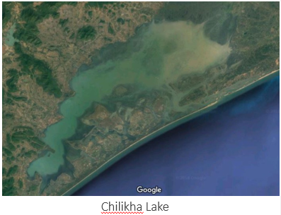

This is a partly inland water body located towards the North Eastern India, which is amongst world's largest brackish lagoons. It also happens to be one of the most frequent hub for Cyanoblooms. 

- Okeechobee Lake, Florida, US

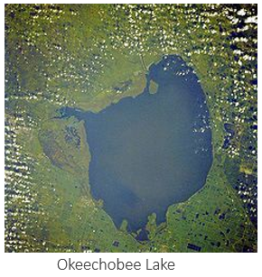

Famously known as *Florida's Inland Sea*, this is the largest freshwater lake in Florida and is exceptionally shallow for its size. This site also happens to be one of the most frequent hubs for algal blooms world-wide, after the Utah lake. 

## Datasets

For this study, level 2 images from Sentinel 2A were used. The Copernicus Mission is open-source and provides the latest captures for civil use on their [Open Data Hub (Copernicus DHUS)](https://scihub.copernicus.eu/dhus/#/home).

A [python API](https://sentinelsat.readthedocs.io/en/stable/) for this platform is also available, which allows users to query the database and download products within the python script itself. 

## Results

The feature extraction kernel for water body detection in the satelite imagery outputs a single band satellite image with hues from black through white, with the most probable pixels for water bodies with higher DN values, hence highlighting them as very bright features and the rest in a darker hue.

- Chilikha Lagoon, Orissa, India

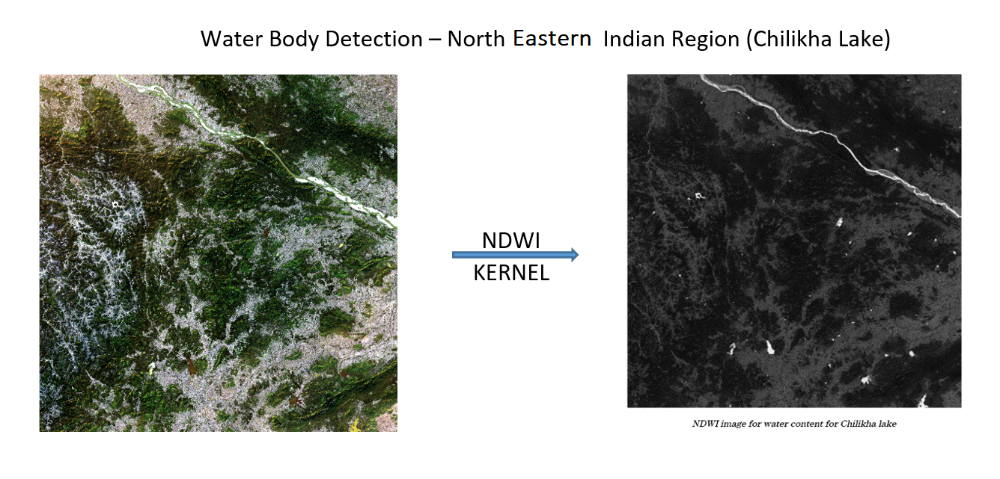

- Okeechobee Lake, Florida, US

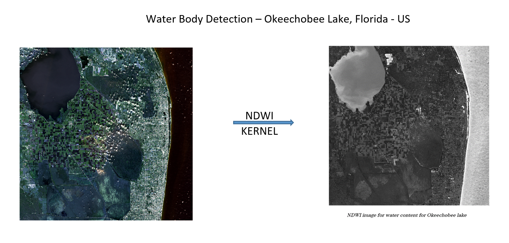

## Results on the Landsat 8 data

For this study, the Landsat 8 images for the same regions were used for which level 2 correction was to be performed. Following images for the NDWI indices for water content and leaf moisture content is calculated and generated:

- NDWI(water content) for Chilikha Lagoon, Orissa, India


- NDWI(leaf moisture content) for Chilikha Lagoon, Orissa, India


- NDWI(water content) for Okeechobee Lake, Florida, US


- NDWI(leaf moisture content) for Okeechobee Lake, Florida, US


## Algorithm of performing the Thresholding on Sentinel2A indices 

- Converted the TIFF file corrosponding to the interested intex into a gray scale image

- Plotted the graph of number of pixels Vs. gray scale to find the value of the threshold

- Generated the binary image with respect to the threshold obtained in the prevoius step

## Results obtained by the implementation of the algorithm

- NDWI(leaf moisture content) for Chilikha, Orissa, India

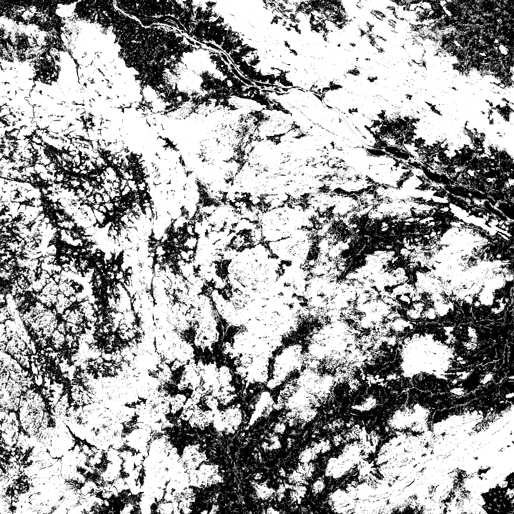

- NDWI(Water content) for Chilikha, Orissa, India


- NDCI for Chilikha, Orissa, India

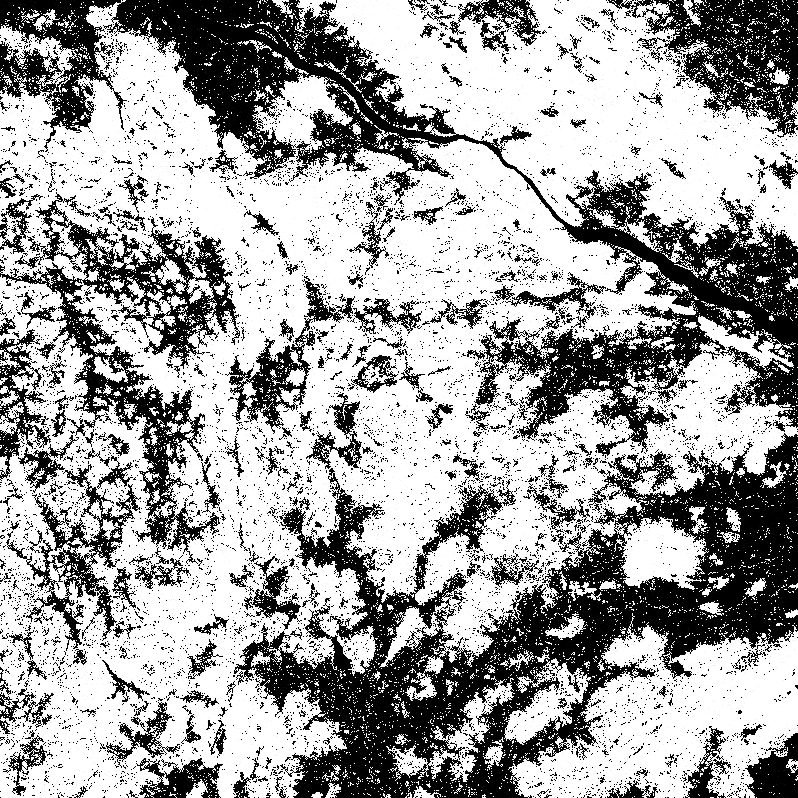

- NDWI(leaf moisture content) for Okeechobee, Florida, US

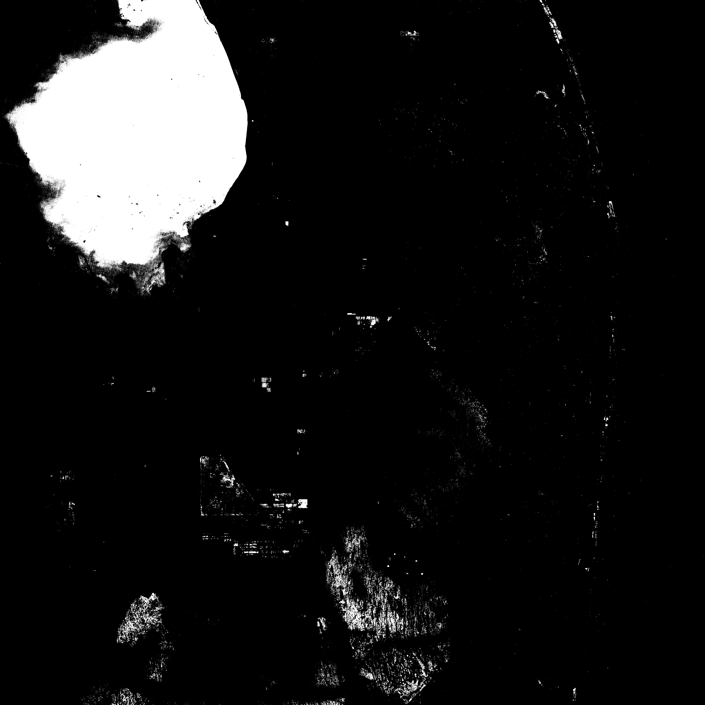

- NDWI(Water content) for Okeechobee, Florida, US


- NDWI(leaf moisture content) for Okeechobee, Florida, US

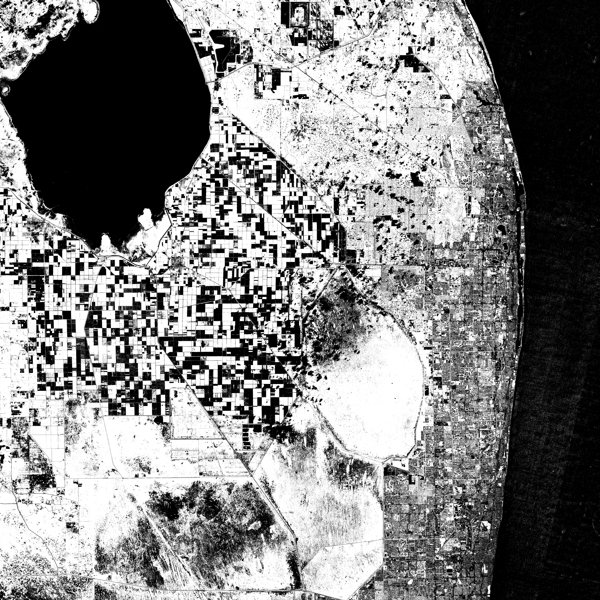

## Spectral Modulation of Multi-Spectral Images

Algorithm for Spectral Modulation:

- Supervised classification is performed for multispectral images.
- Different classes are identified by a modulation function.
- Suppose there are 4 bands- b1,b2,b3,b4 and pattern as (120,110,100,90) then modulation pattern is:'222222' based on (120>110,120>100,120>90,110>100,110>90,100>90)
- '2' represents preceeding band value is greater
- '1' represents succeeding band value is greater
- '0' represents both band values are equal
- Each pixel vector of size 4 is identified in underlying classes since only 4 bands are there in image. 

## Results obtained using Spectral Modulation on Landsat 8 dataset

-  LS8_TM_swir_water__Chilikha for Chilikha,Orissa
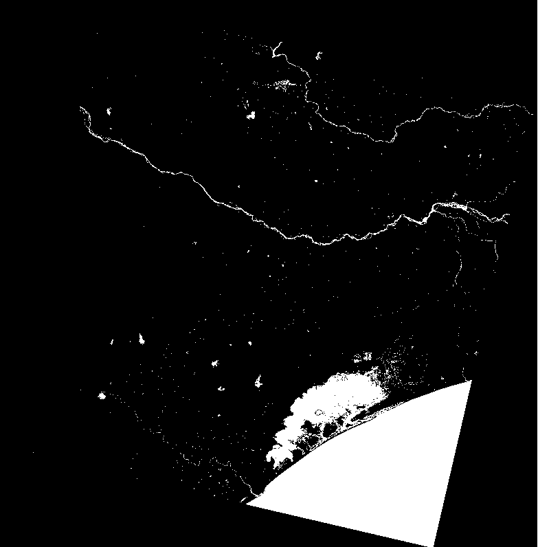

- LS8_TM_all_classes__Chilikha for Chilikha, Orissa
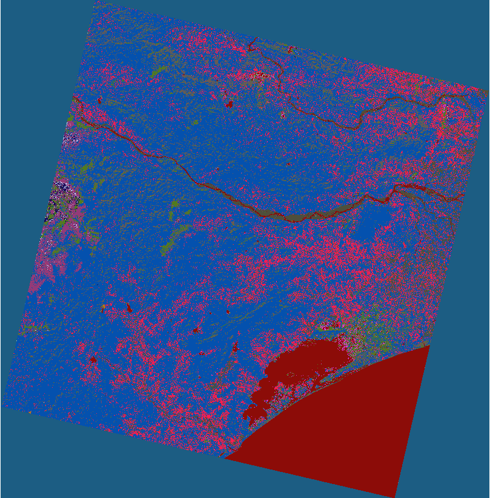

- LS8_TM_swir_water__Okeechobe for Okeechobe,Florida US
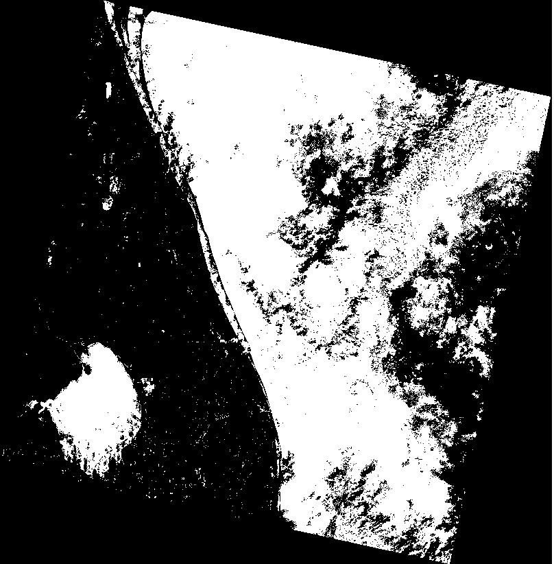
 - LS8_TM_all_classes__Okeechobe for Okeechobe, Florida US
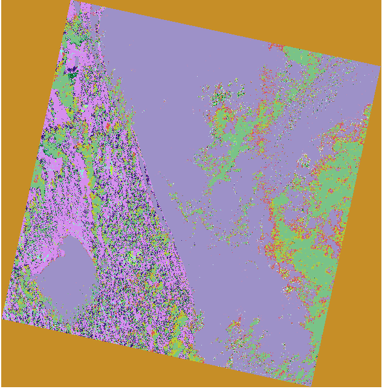

## Results obtained using Spectral Modulation on Sentinel 2A dataset

-  Sentinel2A_TM_swir_water__Chilikha for Chilikha,Orissa
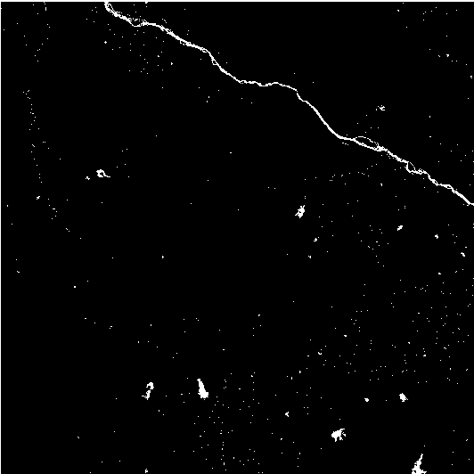

-  Sentinel2A_TM_all_classes__Chilikha for Chilikha, Orissa
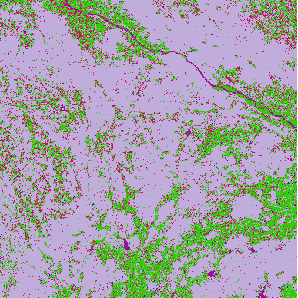

- Sentinel2A_TM_swir_water__Okeechobe for Okeechobe,Florida US
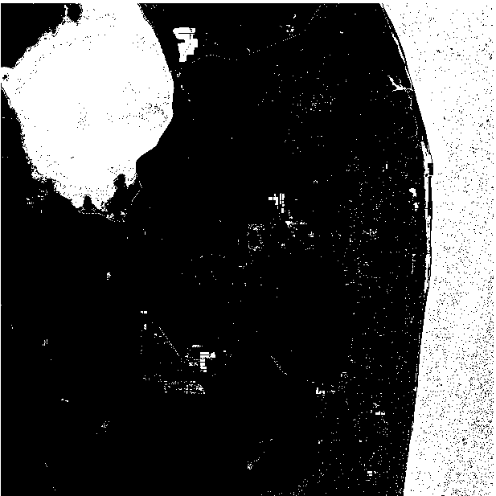

- Sentinel2A_TM_all_classes__Okeechobe for Okeechobe, Florida US
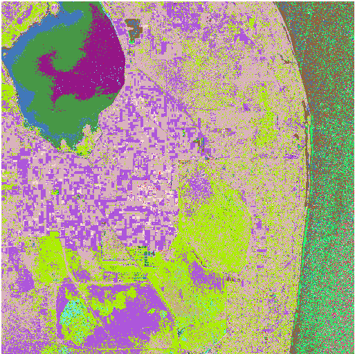

## Contribution

[](https://gitter.im/Water-Based-Indices-on-Sentinel-2A-Images-using-Python/community?utm_source=badge&utm_medium=badge&utm_campaign=pr-badge)

Please feel free to raise issues and fix any existing ones. Further details can be found in our [code of conduct](https://github.com/Chintan2108/Water-Based-Indices-on-Sentinel-2A-Images-using-Python/blob/master/CODE_OF_CONDUCT.md).

### While making a PR, please make sure you:
- [ ] Always start your PR description with "Fixes #issue_number", if you're fixing an issue.
- [ ] Briefly mention the purpose of the PR, along with the tools/libraries you have used. It would be great if you could be version specific.
- [ ] Briefly mention what logic you used to implement the changes/upgrades.
- [ ] Provide in-code review comments on GitHub to highlight specific LOC if deemed necessary.
- [ ] Please provide snapshots if deemed necessary.
- [ ] Update readme if required.

## References

```
Bo-cai Gao, NDWI—A normalized difference water index for remote sensing of vegetation liquid water from space, Remote Sensing of Environment, Volume 58, Issue 3, 1996, Pages 257-266.
```

```
T J Malthus, A G Dekker, First Derivative Indices for the Remote Sensing of Inland Water Quality using High Spectral Resolution Reflectance, Environment International, Volume 22, Issue 2, 1995, Pages 221-232.
```

Also, a shoutout to [Abdishakur](https://towardsdatascience.com/satellite-imagery-access-and-analysis-in-python-jupyter-notebooks-387971ece84b) and [shakasom](https://gist.github.com/shakasom) for great online references and tutorials on the opensource remote sensing libraries available in the Python community.
